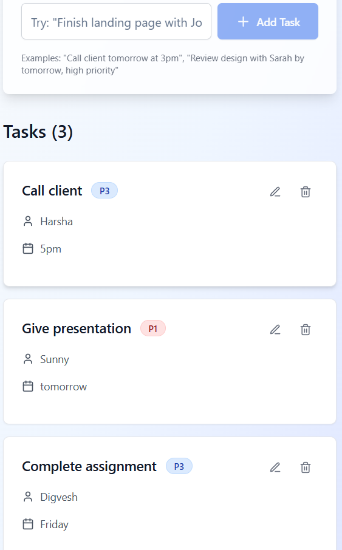

# Natural Task Scribe

An AI-powered transcript parser that automatically extracts tasks from meeting transcripts and organizes them in a beautiful task board.

## Features

- 📝 Paste meeting transcripts and automatically extract tasks
- 👥 Automatically identifies task assignees
- ⏰ Detects and parses deadlines
- 🎯 Priority levels: P1 (High), P2 (Medium), P3 (Low)
- ✨ Modern, responsive UI with task cards
- ✅ Mark tasks as complete
- 🎨 Color-coded priorities and completion status
- 🔄 Prevents duplicate task creation for same transcript


### Prerequisites

- Node.js 18.x or later
- npm 9.x or later

### Installation

1. Clone the repository:
```bash
git clone https://github.com/Harsha-Reddy21/AI-powered-transcript-parser.git
cd AI-powered-transcript-parser
```

2. Install dependencies:
```bash
npm install
```

3. Start the development server:
```bash
npm run dev
```

4. Open [http://localhost:8080](http://localhost:3000) in your browser.

## Usage

1. Navigate to the web app
2. Paste your meeting transcript in the text area
3. Click "Extract Tasks"
4. View and manage your tasks in the task board below


## Example Transcript

```
Aman you take the landing page by 10pm tomorrow. Rajeev you take care of client follow-up by Wednesday. Shreya please review the marketing deck tonight.
```

### Output Screenshot

- Web
  

- Mobile
  

### LLM Response
```json
{
  "tasks": [
    {
      "title": "Take the landing page",
      "assignee": "Aman",
      "date": "10pm tomorrow",
      "priority": "P1"
    },
    {
      "title": "Take care of client follow-up",
      "assignee": "Rajeev",
      "date": "Wednesday",
      "priority": "P3"
    },
    {
      "title": "Review the marketing deck",
      "assignee": "Shreya",
      "date": "tonight",
      "priority": "P3"
    }
  ]
}
```

